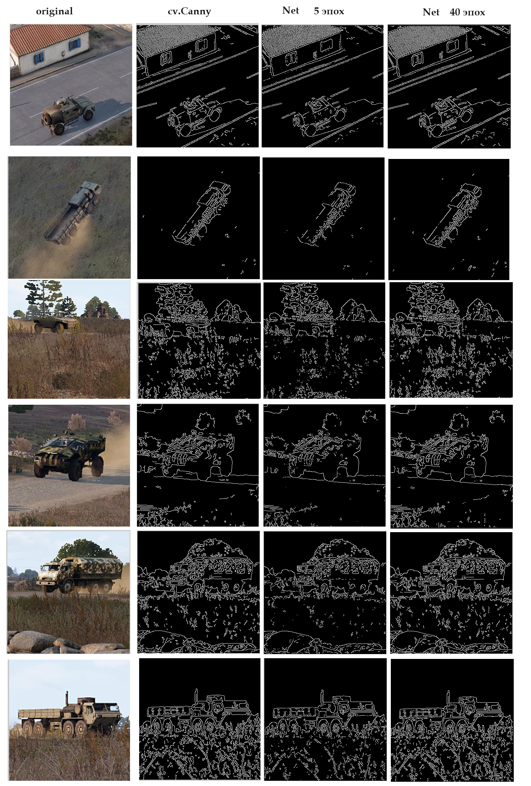

# Выполненное тестовое задание от Мотькина Игоря (motskin@tut.by)
## Условия задания:
1. Реализовать средствами pytorch детектор границ Canny https://en.wikipedia.org/wiki/Canny_edge_detector
2. Установить необходимые параметры модеи
3. Сравнить полученное решение с OpenCV реализацией
4. Попробовать собранную натренировать модель с целью получить более оптимальные веса

# Общая информация
- Запуск и отладка выполнялись под WSL (Ubuntu 22.04) развёрнутая на Windows 11
- Среда разворачивается в conda. В проекте добавлен соответствующий файл **environment.yml**. Ниже привёл команду для развёртывания.
- В качестве данных использовал собственный датасет Арма. 
- Предоставлю ссылку на уменьшенный датасет (320 изображений для обучения и 64 для валидации и тестирования)
https://disk.yandex.com/d/16mFWVF7YbR-1g Эти две папки можно скопировать в корень проекта
- Все изображения имеют фиксированный размер 350 на 350 пикселей. Сделал такое упрощение, так как в задании не было указано какой должен быть датасет и какие требования предъявляются к изобаржениям

# Структура проекта
1. В основном почти все файлы относятся к задаче, напрямую связаннуые с заданием, по постронению нейронной сети.
- Файл **train.py** используется для обучения нейронной сети
- Файл **predict.py** используется для ранее обученной модели, когда нам необходимо получить маски на основе нейронной сети, но чтобы выглядели также как и метод Canny.  
2. Есть ещё два вспомогательных файла.
- **canny_process.py** используется для получения датасета масок на основе метода Canny. Именно на этих данных и будем обучать модель. 
- **canny_experiment.py** программа, которая с помощью интерактивной среды позволяет эксперементировать с методом Canny. *Примечание: Данная программа оптимизирована для запуска в Windows, а если запустить по WSL, то будут проблемы с сортировкой окон. Я уже не стал заморачиваться всё делать на одном холсте...*

# Результаты



1. Представленный результат получен на большом датасете, в котором для обучения использовалось более 5 тыс. изображений, При этом Dice коэффициент достигал 0.87
2. Также обучал на маленьком датасете. Так быстрее, но и качество хуже. Dice коэффициент на уровне 0.75. 
3. Делал эксперименты с масштабированием изображений, но при отходе от оригинального размера, качество значительно ухудшалось. Не стал тратить на это время, так как по тестовому заданию этого не требовалось.

# Установка окружения.
На машине должна быть установлена *conda*<br>
Создаём окружение для conda:
```command
conda env create -f environment.yml
```

Активируем environment:
```command
conda activate motskin
```

Если нужно удалить: 
```command
conda remove --name motskin --all
```

